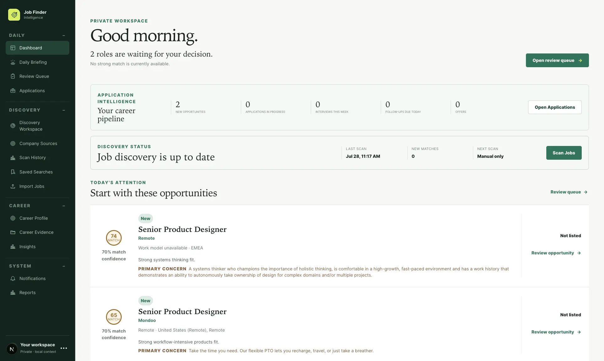
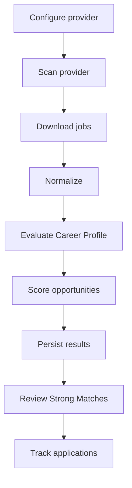

# Job Finder

Desktop-first career intelligence for discovering, evaluating, and managing
product design opportunities.



Job Finder is a personal career operating system that continuously discovers
opportunities across supported Applicant Tracking Systems (ATS), evaluates them
against your career profile, and organizes the entire application lifecycle in
one place.

Unlike a traditional job tracker, Job Finder performs real discovery. It
connects directly to public and authorized ATS providers, imports live
openings, evaluates each role using a deterministic matching engine, and
presents the opportunities that deserve your attention.

Job Finder is a private, single-user application designed to run locally on
macOS. It does not apply to jobs or send candidate information to employers.

## Core capabilities

### Opportunity discovery

Discover jobs directly from supported ATS providers without relying on
commercial job boards.

Current provider support includes:

- Greenhouse
- Lever
- Ashby
- SmartRecruiters
- Workable
- Recruitee
- Comeet
- Personio
- JobScore
- Teamtailor (authorized API)
- Jobvite (authorized employer feed)

Pinpoint has been certified for implementation.

The Discovery Platform supports:

- Public provider APIs
- Public XML and JSON feeds
- Authorized API integrations
- Employer-provided feeds
- Typed provider diagnostics
- Declarative provider capabilities
- Deterministic reconciliation
- Secure credential management
- Universal provider contract testing

### Discovery workspace

The Discovery workspace is the operational center of the application.

Features include:

- Discovery summary
- Strong Match review queue
- Live provider queue
- Provider health monitoring
- Individual provider execution
- Scan All Providers
- Provider diagnostics
- Scan history
- Activity timeline
- Result inspection

Every scan updates live as providers execute independently.

### Deterministic matching

Every imported opportunity is evaluated against your Career Profile.

Each job receives:

- Match score
- Matching explanation
- Strong Match classification
- Persisted evaluation
- Versioned scoring metadata

Discovery focuses on relevant opportunities instead of importing every
available posting.

### Application CRM

Manage the complete application lifecycle with:

- Application tracking
- Kanban workflow
- Table view
- Timeline
- Calendar
- Interview management
- Reminders
- Archive and restore
- Activity history
- Attention indicators

### Career evidence

Maintain reusable career information including:

- Career profile
- Portfolio projects
- Experience
- Skills
- Supporting evidence

Discovery uses this information during opportunity evaluation.

### Discovery accounting

Every discovered job receives exactly one terminal disposition:

- Imported
- Duplicate
- Excluded
- Invalid
- Normalization Failed
- Persistence Failed

Provider totals are fully reconciled, so every discovered opportunity is
accounted for:

```text
266 discovered

1 imported
1 duplicate
264 excluded
```

No discovered job disappears silently.

### Secure provider integration

Sensitive credentials never enter application data.

Supported security features include:

- macOS Keychain storage
- Credential validation
- Safe replacement
- Safe removal
- Regional endpoint selection
- Typed authentication failures
- Robots policy validation
- Retry-After support
- Exponential backoff
- Shared request execution

## Discovery workflow



## Current status

The application is capable of:

- Discovering real jobs from supported ATS providers
- Running concurrent provider scans
- Persisting scan history
- Preventing duplicate imports
- Evaluating opportunities
- Surfacing Strong Matches
- Tracking applications through the hiring process

The project has transitioned from infrastructure development to a
production-ready desktop application focused on daily career management.

## Architecture

Job Finder preserves canonical ATS URLs and routes provider records through one
certified discovery and import pipeline. Matching remains deterministic and
separate from user decisions, while Career Evidence provides traceable context
without changing scores.

See [Architecture](docs/architecture.md),
[Matching Policy](docs/matching-policy.md), and the individual connector
contracts in [`docs/`](docs/).

## Technology

- Next.js
- React
- TypeScript
- Prisma
- SQLite
- Tailwind CSS
- macOS Keychain integration
- Vitest

## Privacy

- Your resume stays local.
- Your portfolio stays local.
- Your job history stays local.
- There is no cloud synchronization.
- There are no automatic applications.
- There are no hidden AI decisions.

Private context documents, uploaded files, SQLite databases, backups, local
logs, screenshots, and environment-specific configuration are excluded from
source control. The checked-in context files are blank examples only.

## Getting started

Requirements:

- Node.js 22.13 or newer
- npm
- A writable local filesystem

```bash
npm install
cp .env.example .env
cp context/example/*.md context/
npm run db:generate
npm run db:migrate
npm run local:start
```

Open the local application with:

```bash
npm run local:open
```

The database starts empty. Replace the example context files through the
onboarding flow or with your own verified local source material. Never commit
populated context files.

## Development

```bash
npm run lint
npm run typecheck
npm test
npm run build
```

Additional local commands:

```bash
npm run local:stop
npm run db:backup
npm run db:restore -- path/to/private-backup.db
npm run data:audit
npm run data:cleanup -- --dry-run
npm run data:cleanup -- --apply
```

The application binds to `127.0.0.1` by default. SQLite data and backups remain
on the local machine.

## Project goal

Job Finder is designed around one question:

> **What is the next best opportunity for my career?**

The application continuously discovers opportunities, evaluates them using
deterministic scoring, and presents the most relevant roles for review.

Future development focuses on expanding provider coverage, improving career
intelligence, and adding AI-assisted decision support while preserving
explainable, evidence-backed matching.

## License

Private project. No license has been selected.
