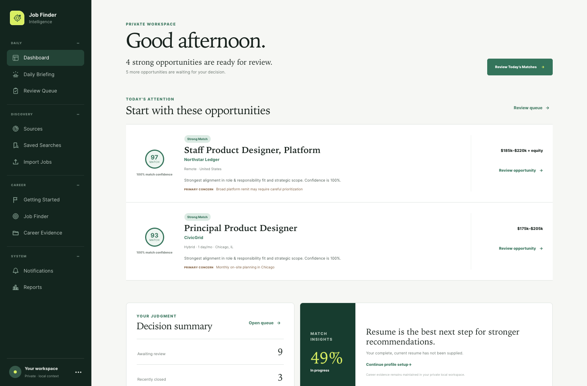
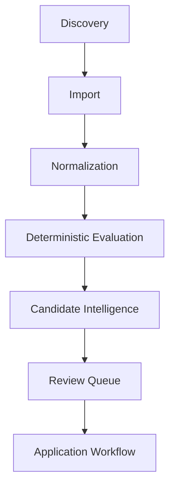

# Job Finder



A desktop-first career intelligence application that automatically discovers
opportunities from multiple ATS providers, evaluates them using deterministic
scoring, and helps candidates prepare stronger applications through explainable
recommendations backed by verified career evidence.

Job Finder is a private, single-user application designed to run locally on
macOS. It does not apply to jobs or send candidate information to employers.

## Features

- Multi-provider ATS discovery
- Scheduled searches
- Duplicate prevention
- Deterministic job matching
- Explainable recommendations
- Daily Briefing
- Review Queue
- Candidate Intelligence
- Career Evidence
- Resume onboarding
- Portfolio readiness
- Match insights
- Local-first architecture

## Philosophy

Job Finder keeps your career data private.

Everything runs locally. Recommendations are explainable. Evidence is never
fabricated. Unknown remains Unknown.

The application assists decision-making but never applies to jobs
automatically.

## Architecture



Discovery connectors preserve canonical ATS URLs and route records through one
certified import path. The evaluation layer remains separate from user
decisions, while Candidate Intelligence adds traceable evidence and preparation
guidance without changing deterministic scores.

See [Architecture](docs/architecture.md) and
[Matching Policy](docs/matching-policy.md) for more detail.

## Technology

- Next.js
- React
- TypeScript
- Prisma
- SQLite
- Tailwind CSS

## Privacy

- Your resume stays local.
- Your portfolio stays local.
- Your job history stays local.
- There is no cloud synchronization.
- There are no automatic applications.
- There are no hidden AI decisions.

Private context documents, uploaded files, SQLite databases, backups, local
logs, screenshots, and environment-specific configuration are excluded from
source control. The checked-in context files are blank examples only.

## Getting started

Requirements:

- Node.js 22.13 or newer
- npm
- A writable local filesystem

```bash
npm install
cp .env.example .env
cp context/example/*.md context/
npm run db:generate
npm run db:migrate
npm run db:seed
npm run local:start
```

Open the local application with:

```bash
npm run local:open
```

The seed contains synthetic demonstration opportunities only. Replace the
example context files through the onboarding flow or with your own verified
local source material. Never commit those populated files.

## Development

```bash
npm run lint
npm run typecheck
npm test
npm run build
```

Additional local commands:

```bash
npm run local:stop
npm run db:backup
npm run db:restore -- path/to/private-backup.db
```

The application binds to `127.0.0.1` by default. SQLite data and backups remain
on the local machine.


## Roadmap

- Additional ATS connectors
- OCR support
- Company Intelligence
- Interview Workspace
- Resume Studio

## License

No license has been selected. This repository is currently unlicensed.
